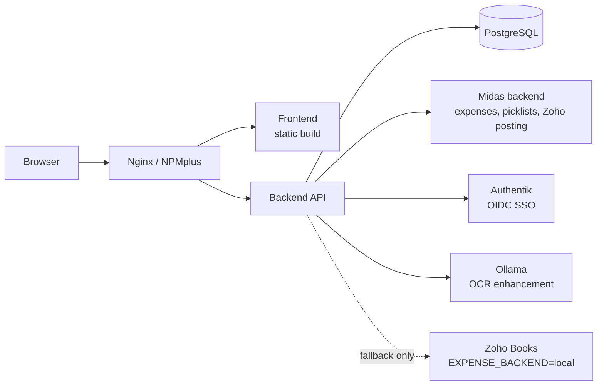

# Argo

Argo is a trade show expense management PWA. It combines OCR receipt scanning (Tesseract, with optional Ollama LLM enhancement for low-confidence extractions), an offline-first architecture built on IndexedDB and a background sync queue, and automated expense approval workflows. It also covers event logistics — booth inventory tracking and packing checklists — and CRM lead capture. Users authenticate via Authentik SSO (OIDC) or local password login. In production, expense data is owned by the Midas backend (`EXPENSE_BACKEND=midas`): Midas stores expenses, serves the category/card/company picklists, and posts to Zoho Books. Argo's own Zoho Books client exists as a flag-gated fallback for `EXPENSE_BACKEND=local` deployments.

## Features

- **Expenses** — submission with receipt upload, OCR field extraction, automated approval (entity assignment and reimbursement decisions auto-approve; reverted fields trigger "needs further review"), per-expense message threads with push notifications, advanced filtering.
- **Events & checklists** — event creation and participant management, per-event logistics checklists (flights, hotels, car rentals, shipping, custom items, reusable templates).
- **Booth inventory** — a catalog of booths and components (weights, photos, attachments), storage locations and containers, and an offline-capable packing checklist that replays queued check-offs idempotently on reconnect.
- **CRM leads** — lead capture tied to events.
- **Reports & show summaries** — filterable expense reports and per-show summaries.
- **Dynamic role system** — system roles (`admin`, `accountant`, `coordinator`, `salesperson`, `developer`, `temporary`, `pending`) plus custom roles created from the Admin UI.
- **Dev dashboard** — diagnostics and tooling, exclusive to the `developer` role.

## Quick Start (Local)

**Prerequisites:** Node 20+, PostgreSQL.

```bash
# 1. Configure environment
cp env.example .env                      # frontend build config (Vite)
cp backend/env.example backend/.env      # backend + database config

# 2. Install dependencies
npm install
cd backend && npm install

# 3. Set up the database (from repo root)
cd backend && npm run migrate && npm run seed
cd ..

# 4. Start frontend + backend together
npm run start:all
```

- Frontend: http://localhost:5173
- Backend: http://localhost:5000
- Demo login: `admin` / `password123`

`./scripts/local-deploy.sh` automates the steps above (checks prerequisites, creates the database if needed, installs dependencies, runs migrations and seed, and starts both servers).

## Commands

### Development

```bash
npm run start:all              # Frontend + backend together
npm run dev                    # Frontend only (http://localhost:5173)
npm run start:backend          # Backend only (http://localhost:5000)
cd backend && npm run dev      # Backend dev server with hot reload
```

### Build

```bash
npm run build                   # Frontend production build
npm run build:sandbox           # Sandbox build (validates env first)
npm run build:production        # Production build (validates env first)

cd backend && npm run build     # Compile TypeScript + copy Python files
```

### Testing

```bash
# Frontend
npm run lint
npm run format:check

# Backend
cd backend && npm test                          # Unit tests (Vitest)
cd backend && npm run test:integration          # Integration tests
cd backend && npm run test:integration:schema   # Schema validation test
cd backend && npm run test:coverage             # Coverage report

# Single test file
cd backend && npx vitest run tests/path/to/file.test.ts
```

### Database

```bash
cd backend && npm run migrate   # Run pending migrations
cd backend && npm run seed      # Seed demo data (admin/password123)
```

## Architecture

```
trade-show-app/
├── src/            # React frontend (Vite, TypeScript)
├── backend/src/    # Express backend (TypeScript, PostgreSQL via raw SQL)
├── public/         # Static assets + service worker (PWA)
├── scripts/        # Build and deployment scripts
└── docs/           # Architecture, deployment, and reference documentation
```



See [docs/ARCHITECTURE.md](docs/ARCHITECTURE.md) for detailed component and data-flow diagrams.

## Documentation

- [docs/ARCHITECTURE.md](docs/ARCHITECTURE.md) — system architecture and diagrams
- [docs/DATABASE.md](docs/DATABASE.md) — database schema reference
- [CHANGELOG.md](CHANGELOG.md) — release history
- [docs/TROUBLESHOOTING.md](docs/TROUBLESHOOTING.md) — common issues and fixes
- [docs/DEPLOYMENT_PROXMOX.md](docs/DEPLOYMENT_PROXMOX.md) — Proxmox/LXC production deployment guide
- [docs/TESTING_STRATEGY.md](docs/TESTING_STRATEGY.md) — test organization and strategy
- [docs/archive/](docs/archive/) — historical documents

See also [CLAUDE.md](CLAUDE.md) for repository conventions used by AI coding assistants.

## Deployment

Bump the version in both `package.json` and `backend/package.json` before deploying.

- **Production:** `scripts/deploy-production-backend.sh` and `scripts/deploy-production-frontend.sh`
- **Sandbox:** `deploy-sandbox-2600.sh`

After a frontend deploy, the NPMplus proxy cache must be cleared. Full instructions, including container topology and rollback: [docs/DEPLOYMENT_PROXMOX.md](docs/DEPLOYMENT_PROXMOX.md).
