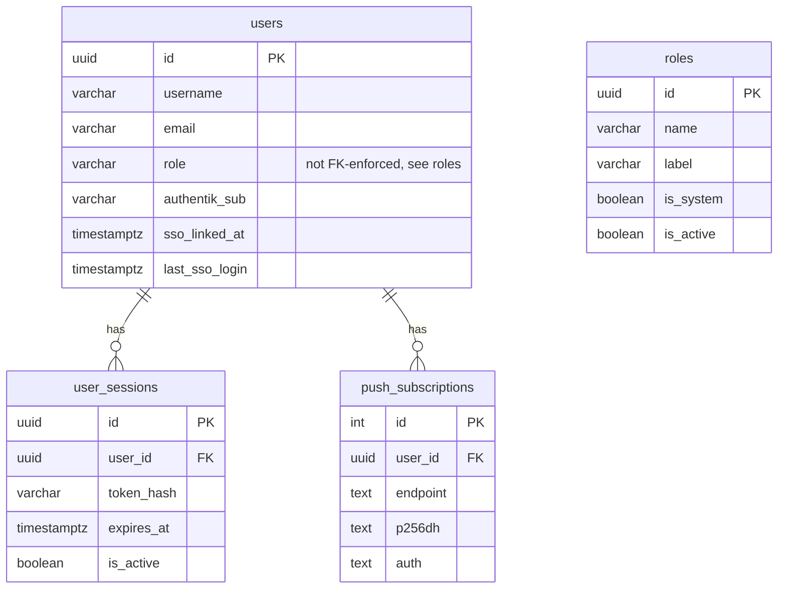
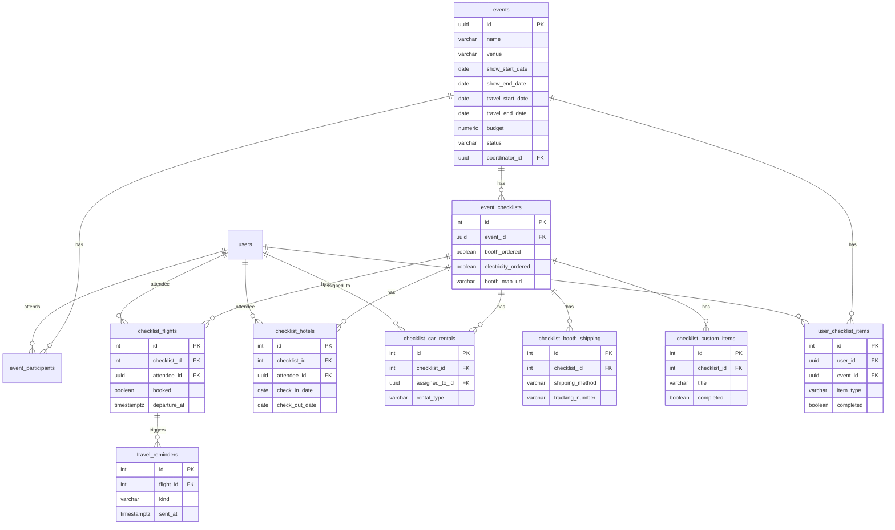
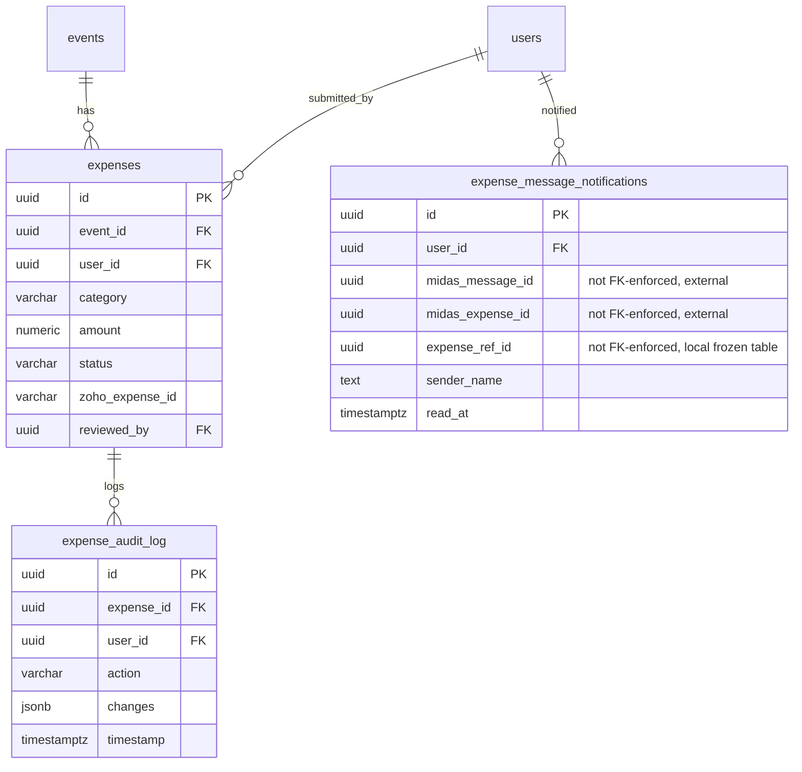
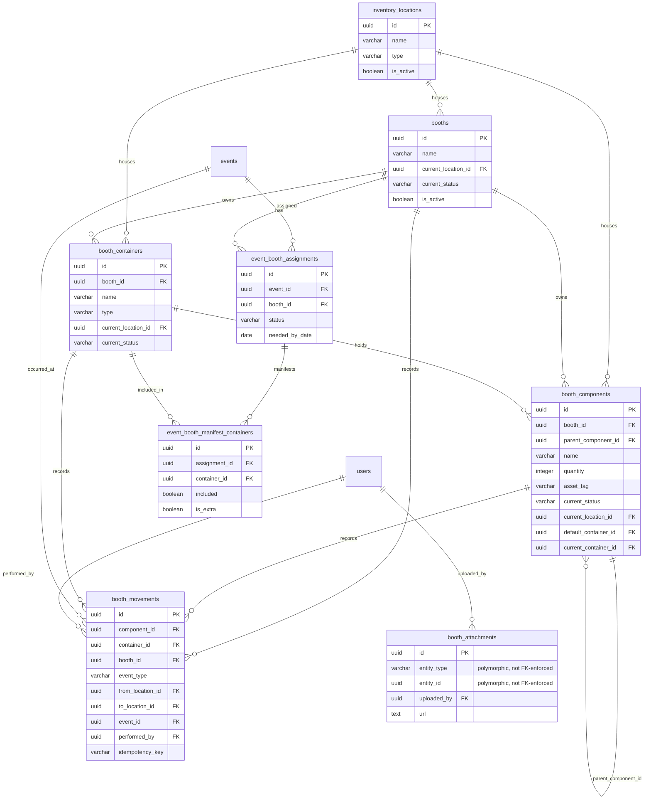
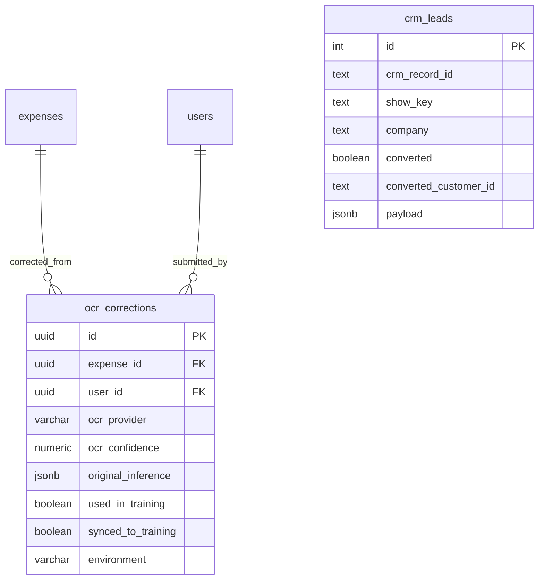

# Argo — Database Schema

Generated from live production schema (`expense_app_production`, CT 2320) on 2026-09-01.

All access is raw SQL with parameterized queries — no ORM. Schema changes live in `backend/src/database/migrations/` as numbered `NNN_description.sql` files and auto-run at backend startup via `migrate.ts`. See [ARCHITECTURE.md](ARCHITECTURE.md) for service/topology context; this document covers schema shape only.

**46 objects** in the `public` schema: 43 base tables, 2 views, and 1 ad-hoc backup table (see [Table inventory](#table-inventory)).

> **`expenses` is FROZEN.** As of the 2026-08 Midas cutover, the system of record for expense data is the external Midas service, not this table. `backend/src/services/expenseStore/` still reads/writes it as a flag-gated fallback (`EXPENSE_BACKEND=local`), but in production the table is no longer the source of truth — see ARCHITECTURE.md §3 (`ExpenseStore` / `MidasExpenseStore`). Its FK graph below reflects the live schema as-is; treat it as historical/fallback structure, not the active data path.

## Contents

- [Users & auth](#users--auth)
- [Events & checklist](#events--checklist)
- [Expenses](#expenses-frozen)
- [Booth inventory](#booth-inventory)
- [CRM & OCR training](#crm--ocr-training)
- [Table inventory](#table-inventory)
- [Migrations](#migrations)

---

## Users & auth

`users` is the identity table for both local password login and Authentik SSO (`authentik_sub`, `sso_linked_at`, `last_sso_login`). `roles` backs the dynamic role system (CLAUDE.md: system roles are seeded rows, custom roles are added via the Admin UI); `users.role` stores the role name but is **not** an enforced FK to `roles.name` in the live schema — it's a free-text column validated at the application layer. `user_sessions` and `push_subscriptions` both hang off `users` by FK.

## Events & checklist

`events` is the trade-show record (venue, dates, budget, coordinator). `event_participants` is the many-to-many join to `users`. `event_checklists` is the per-event logistics checklist header, fanning out into typed line-item tables (`checklist_flights`, `checklist_hotels`, `checklist_car_rentals`, `checklist_booth_shipping`, `checklist_custom_items`). `checklist_templates` is a standalone catalog of reusable checklist item titles (seeded/admin-managed, not FK-linked to a specific event). `user_checklist_items` is a separate per-user/per-event completion tracker layered on top. `show_summaries` is a standalone historical reporting table (year/company/category totals), not FK-linked to `events`.

`checklist_templates` and `show_summaries` are omitted from the diagram — neither carries an FK into this domain. `checklist_templates(id, title, position, is_active)` seeds new checklists; `show_summaries(show_name, year, company, category, amount)` is an independent reporting table.

## Expenses (FROZEN)

`expenses` is frozen — see the callout at the top of this document. `expense_audit_log` is an immutable append-only log of changes to expense records (`changes` jsonb, one row per action). `expense_message_notifications` surfaces Midas-side message activity as in-app notifications for a user; its `midas_message_id`/`midas_expense_id`/`expense_ref_id` columns are **not** FK-enforced — they're soft pointers into Midas-owned data (Midas is external, so there's nothing local to reference), consistent with Midas now owning the expense system of record.

## Booth inventory

Added by migration `039_create_booth_inventory.sql` (v2.20.0). Three layers per that migration's own header comment: `booths` own `booth_containers` (crates/cases/bags) and `booth_components` (frame, fabric, lights — either a counted pool or one tagged physical object). Location, container, and status are tracked independently, and every change appends an immutable row to `booth_movements` (idempotency-keyed, since offline packing replays movements from a client queue). `inventory_locations` is deliberately not named `locations` because `events` already carries venue/city/state. `event_booth_assignments` + `event_booth_manifest_containers` link booths/containers to a specific event's packing manifest. `booth_attachments` is polymorphic (`entity_type` + `entity_id`, not FK-enforced) — it can point at a booth, container, or component.

Simplification note: `booth_components`, `booth_containers`, and `booth_movements` each carry more than one FK to the same target table (e.g. `booth_movements.from_location_id` / `to_location_id` both → `inventory_locations`; `booth_components.default_container_id` / `current_container_id` both → `booth_containers`). The diagram draws one representative relationship line per table pair rather than every individual column — the full column-level FK list is in `/tmp/argo-fks.txt` from this session's introspection, or re-derivable via the query in [Migrations](#migrations).

## CRM & OCR training

`crm_leads` is a standalone table synced from an external CRM (`payload` jsonb + conversion tracking columns); it has no FK relationships in the live schema. `ocr_corrections` records user corrections to OCR/LLM extraction output, FK'd to the (frozen) `expenses` table and to `users`. Two views layer on top: `ocr_training_ready_corrections` (a filtered/joined view exposing corrections plus submitter name/email, for training-set export) and `ocr_correction_stats_by_env` (aggregate counts per environment). Both are views, not base tables — they carry no independent FK constraints of their own.

`ocr_training_ready_corrections` (VIEW) and `ocr_correction_stats_by_env` (VIEW) are omitted from the diagram since they have no FK graph of their own; both are listed in the table inventory below.

---

## Table inventory

Every object in `information_schema.tables` for `public` (43 base tables + 2 views + 1 backup table = 46), covering all domains above plus operational/integration tables not diagrammed individually (API/page analytics, audit log, system monitoring, Telegram bot, idempotency, app settings) — those are single-purpose logging/integration tables without a meaningful ER relationship graph.

| Table | Purpose |
|---|---|
| `_rename_backup_20260812` | Ad-hoc backup snapshot of `users`-shaped rows taken 2026-08-12 (no PK, no FK, not part of the managed schema — operational artifact from a rename, not migration-managed). |
| `api_analytics` | Per-request analytics: endpoint, method, status, timing, size, IP. |
| `api_requests` | Per-request log with metadata jsonb, error message; broader/older sibling of `api_analytics`. |
| `app_settings` | Key/value app configuration store (`key`, `value` jsonb). |
| `audit_logs` | General-purpose audit trail (action, entity, before/after `changes`, actor). |
| `booth_attachments` | Photos/files attached to a booth, container, or component (polymorphic). |
| `booth_components` | Individual booth parts (frame, fabric, lights) — pooled or asset-tagged. |
| `booth_containers` | Physical crates/cases/bags that hold components. |
| `booth_movements` | Immutable log of every booth/component/container location or status change. |
| `booths` | Top-level physical booth assets. |
| `checklist_booth_shipping` | Booth shipping method/carrier/tracking for an event checklist. |
| `checklist_car_rentals` | Car rental booking line items for an event checklist. |
| `checklist_custom_items` | Free-form custom to-do items on an event checklist. |
| `checklist_flights` | Flight booking line items for an event checklist. |
| `checklist_hotels` | Hotel booking line items for an event checklist. |
| `checklist_templates` | Reusable checklist item catalog used to seed new event checklists. |
| `crm_leads` | Leads synced from the external CRM, with conversion tracking. |
| `event_booth_assignments` | Links a booth to an event's packing/setup assignment. |
| `event_booth_manifest_containers` | Which containers are included in an event's booth manifest. |
| `event_checklists` | Per-event logistics checklist header (booth/electricity ordering, map). |
| `event_participants` | Many-to-many join of users to events. |
| `events` | Trade show event record: venue, dates, budget, coordinator, status. |
| `expense_audit_log` | Immutable append-only change log for expense records. |
| `expense_message_notifications` | In-app notifications sourced from Midas expense message activity. |
| `expenses` | **FROZEN.** Local expense records; system of record moved to Midas at the 2026-08 cutover. Retained as a flag-gated fallback store. |
| `idempotency_keys` | Dedup keys for idempotent write operations, with expiry. |
| `inventory_locations` | Physical/logical locations booth assets can be stored (warehouse, storage unit, show site, etc). |
| `midas_message_sync_state` | Cursor/watermark state for polling Midas for new expense messages. |
| `ocr_correction_stats_by_env` | **VIEW** — aggregate OCR correction stats grouped by environment. |
| `ocr_corrections` | User corrections to OCR/LLM receipt extraction, used for training feedback. |
| `ocr_training_ready_corrections` | **VIEW** — corrections joined with submitter identity, for training-set export. |
| `page_analytics` | Per-page-view analytics (path, title, session, duration, referrer). |
| `push_subscriptions` | Web Push (VAPID) subscription endpoints per user. |
| `roles` | Dynamic role definitions (system + custom), backing the role system. |
| `schema_migrations` | Tracking table of applied migration versions (see below). |
| `show_summaries` | Historical show-level expense totals by year/company/category. |
| `system_alerts` | Operational alerts (type, severity, threshold, acknowledgement). |
| `system_metrics` | Time-series operational metrics (type, value, unit, status). |
| `telegram_event_drafts` | In-progress event creation drafts started via the Telegram bot. |
| `telegram_link_tokens` | One-time tokens for linking a Telegram account to an Argo user. |
| `telegram_links` | Confirmed Telegram-account-to-user links. |
| `telegram_receipt_jobs` | Receipt photos submitted via Telegram, pending OCR/expense creation. |
| `travel_reminders` | Scheduled reminders tied to a flight checklist entry. |
| `user_checklist_items` | Per-user, per-event checklist item completion tracking. |
| `user_sessions` | Active/expired login sessions (token hash, IP, last activity). |
| `users` | User accounts — local password auth and/or Authentik SSO identity. |

## Migrations

Migrations are numbered SQL files in `backend/src/database/migrations/` (`NNN_description.sql`), applied in order at backend startup by `backend/src/database/migrate.ts`. Successful application is recorded as a row in `schema_migrations(version, applied_at)`.

One relevant detail from `migrate.ts`: recording a migration as applied is a separate step *after* the migration's DDL runs, and `recordMigration()` deliberately swallows its own errors ("migration was successful, just tracking failed") rather than throwing — so it's possible for a migration's schema changes to be live while its version row never lands in `schema_migrations`.

**Cross-check performed this session** (repo files vs. live `schema_migrations` on CT 2320, `expense_app_production`):

- Migration files present in the repo: **37** (numbered `002`–`039`; `001` and `005` do not exist in the repo).
- Versions recorded in `schema_migrations` on prod: **15** — `015`, and `025`–`039` except `029`.
- Versions present as files but **absent** from `schema_migrations`: `002`–`004`, `006`–`014`, `016`–`024`, `029` (22 files).

For every one of those absent versions, the schema objects the migration creates were confirmed present in the live introspection (e.g. `roles`/`audit_logs`/`user_sessions`/`api_requests` from `003`/`004`/`008`/`009`; `event_checklists`/`checklist_custom_items`/`checklist_templates`/`user_checklist_items` from `017`–`019`/`024`; `event_checklists.booth_map_url` from `021`; `checklist_car_rentals.assigned_to_id`/`assigned_to_name` from `022`; `api_requests.metadata` from `020`; and — notably — the `push_subscriptions` table itself from `029`). In other words: none of these look like migrations that were actually skipped; the schema changes are live, but the tracking rows for versions before `025` were never backfilled (unsurprising — `025` is the migration that *creates* `schema_migrations`), and `029` is applied-but-unrecorded despite running after the tracking table existed, consistent with the `recordMigration()` swallow-on-failure behavior described above. `015` is recorded despite predating `025`, so it was apparently backfilled or re-run after tracking existed.

This is a live-database observation, not a repo-only claim — the local `schema_migrations` table (as of this cleanup effort) reports a different row count than production. Treat prod as ground truth for what has actually run; treat the repo's migration files as ground truth for what *should* eventually be reflected in `schema_migrations` everywhere.
