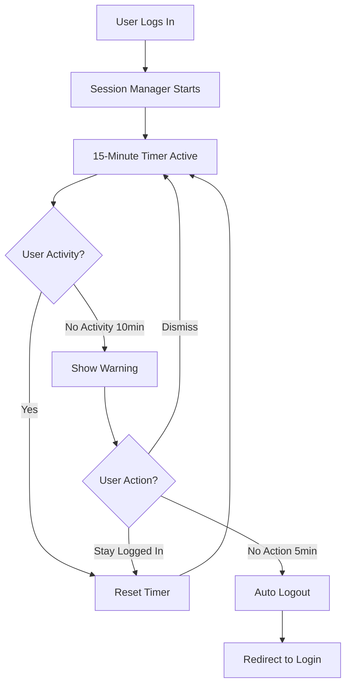

# Session Management with Sliding Expiry Timer

## Overview

The ExpenseApp implements a robust session management system with sliding expiry timer to enhance security and user experience. This feature automatically logs users out after a period of inactivity while providing warnings and seamless token refresh during active use.

## Features

### 1. Sliding Expiry Timer
- **15-minute inactivity timeout** - Users are logged out after 15 minutes of no activity
- **Automatic reset on activity** - Timer resets whenever user interacts with the app
- **Smart activity detection** - Tracks mouse, keyboard, scroll, touch, and navigation events

### 2. Warning System
- **5-minute advance warning** - Users are warned 5 minutes before logout
- **Countdown timer** - Visual countdown showing exact time remaining
- **Dismissible modal** - Users can dismiss the warning and continue working
- **Stay logged in button** - Resets the timer and dismisses the warning

### 3. Token Refresh
- **Automatic refresh every 10 minutes** - Tokens are refreshed during activity
- **Seamless experience** - Users remain logged in without interruption
- **Backend endpoint** - `/api/auth/refresh` handles token renewal

### 4. Backend Alignment
- **JWT expiry: 20 minutes** - Slightly longer than frontend timeout
- **5-minute buffer** - Ensures tokens don't expire during warning period

## Configuration

### Frontend Configuration

File: `src/utils/sessionManager.ts`

```typescript
const INACTIVITY_TIMEOUT = 15 * 60 * 1000; // 15 minutes
const WARNING_TIME = 5 * 60 * 1000;        // 5 minutes before logout
const TOKEN_REFRESH_INTERVAL = 10 * 60 * 1000; // Refresh every 10 minutes
```

**To adjust timeout:**
1. Update `INACTIVITY_TIMEOUT` (in milliseconds)
2. Update `WARNING_TIME` (recommended: 1/3 of inactivity timeout)
3. Update `TOKEN_REFRESH_INTERVAL` (recommended: 2/3 of inactivity timeout)

### Backend Configuration

File: `backend/src/routes/auth.ts`

```typescript
const token = jwt.sign(
  { id: user.id, username: user.username, role: user.role },
  process.env.JWT_SECRET,
  { expiresIn: '20m' } // Should be >= INACTIVITY_TIMEOUT
);
```

**To adjust JWT expiry:**
1. Change `expiresIn` value (e.g., '30m', '1h')
2. Must be greater than or equal to `INACTIVITY_TIMEOUT`
3. Recommended: Add 5-minute buffer beyond inactivity timeout

## Activity Detection

The session manager tracks the following user activities:

- **Mouse events:** `mousedown`, `mousemove`, `click`
- **Keyboard events:** `keypress`
- **Touch events:** `touchstart` (mobile)
- **Scroll events:** `scroll`
- **Navigation:** `popstate` (route changes)

**Debouncing:** Activity events are debounced to 1 second to prevent excessive timer resets.

## User Flow

### Normal Activity Flow



### Token Refresh Flow

```
User Active → 10 minutes pass → SessionManager calls /api/auth/refresh
→ Backend validates old token → Issues new 20-minute token
→ Frontend stores new token → User continues seamlessly
```

## API Endpoints

### POST /api/auth/refresh

Refreshes an authentication token.

**Headers:**
```
Authorization: Bearer <current_token>
```

**Response:**
```json
{
  "token": "new_jwt_token_here"
}
```

**Error Responses:**
- `401` - No token provided
- `403` - Invalid token
- `500` - Internal server error

## Security Considerations

1. **Inactivity Protection** - Automatically logs out inactive users to prevent unauthorized access
2. **Token Expiration** - Short-lived tokens (20 minutes) limit exposure window
3. **Secure Refresh** - Tokens can only be refreshed with valid credentials
4. **Warning System** - Prevents unexpected logouts and data loss
5. **Activity Tracking** - Robust detection ensures active users aren't logged out

## Logging

The session manager includes comprehensive logging for debugging:

**Frontend Logs:**
```javascript
[SessionManager] Initializing with 15-minute inactivity timeout
[SessionManager] Activity listeners registered
[SessionManager] Showing inactivity warning (5 minutes until logout)
[SessionManager] User activity detected, dismissing warning
[SessionManager] Inactivity timeout reached, logging out user
[SessionManager] Refreshing authentication token
[SessionManager] Token refreshed successfully
[SessionManager] Cleaning up timers and listeners
```

**Backend Logs:**
```
[Auth] Token refreshed for user: admin@example.com
```

## Testing

### Manual Testing Steps

1. **Test Inactivity Logout:**
   - Log in to the application
   - Don't interact for 15 minutes
   - Verify warning appears at 10-minute mark
   - Verify auto-logout at 15-minute mark

2. **Test Activity Reset:**
   - Log in to the application
   - Wait 10 minutes for warning
   - Move mouse or press a key
   - Verify warning dismisses
   - Verify timer resets

3. **Test Token Refresh:**
   - Log in to the application
   - Stay active for 25+ minutes
   - Check browser console for refresh logs
   - Verify no logout occurs

4. **Test Warning Actions:**
   - Log in and wait for warning
   - Click "Stay Logged In" → Verify timer resets
   - Wait for warning again
   - Click "Dismiss" → Verify modal closes but timer continues

### Automated Testing

See `SESSION_MANAGEMENT.test.ts` (to be implemented).

## Troubleshooting

### Users Being Logged Out Too Quickly

**Check:**
1. `INACTIVITY_TIMEOUT` setting - Ensure it's 15+ minutes
2. Activity listeners - Verify events are being tracked
3. Browser console - Look for SessionManager logs

**Solution:** Increase `INACTIVITY_TIMEOUT` in `sessionManager.ts`

### Warning Not Appearing

**Check:**
1. `WARNING_TIME` setting - Should be < `INACTIVITY_TIMEOUT`
2. Browser console - Look for callback errors
3. Modal rendering - Verify `InactivityWarning` component

**Solution:** Check callback initialization in `App.tsx`

### Token Refresh Failing

**Check:**
1. Backend endpoint `/api/auth/refresh`
2. Token in localStorage
3. Backend logs for errors

**Solution:** Verify backend is running and endpoint is accessible

### Users Staying Logged In Too Long

**Check:**
1. JWT expiry time in backend
2. SessionManager initialization

**Solution:** Reduce `expiresIn` in `auth.ts`

## Performance Impact

**Minimal Impact:**
- Activity listeners use passive event handlers
- Debouncing prevents excessive timer resets (1 second)
- Token refresh only every 10 minutes
- Modal only renders when warning is active

**Memory Usage:**
- SessionManager singleton: ~1KB
- Event listeners: negligible
- Timers: 3 active at most

## Browser Compatibility

- ✅ Chrome/Edge (Chromium): Full support
- ✅ Firefox: Full support
- ✅ Safari: Full support
- ✅ Mobile browsers: Full support (touch events)
- ✅ IE11: Not supported (app requires modern browser)

## Future Enhancements

1. **Configurable timeouts** - Admin settings for timeout duration
2. **Per-role timeouts** - Different timeouts for different user roles
3. **Activity analytics** - Track user activity patterns
4. **Session history** - Log of user sessions and timeouts
5. **Remember me** - Extended session option

## Migration Guide

### From Previous Version

No migration required. The session management feature is **new** in v1.0.3 and doesn't affect existing data or sessions.

**Users will need to:**
- Log in again after deployment (old 24h tokens will expire)
- Be aware of the new 15-minute inactivity timeout

**Communicate to users:**
"For security, you'll now be automatically logged out after 15 minutes of inactivity. You'll receive a warning 5 minutes before logout."

## Version History

- **v1.0.3** - Initial implementation of session management with sliding expiry timer

## Support

For issues or questions:
1. Check browser console for [SessionManager] logs
2. Check backend logs for [Auth] messages
3. Verify configuration in `sessionManager.ts` and `auth.ts`
4. Review this documentation

## Related Documentation

- `docs/QUICKSTART.md` - Getting started guide
- `docs/TROUBLESHOOTING.md` - General troubleshooting
- `backend/src/middleware/auth.ts` - Authentication middleware
- `src/hooks/useAuth.ts` - Authentication hook

